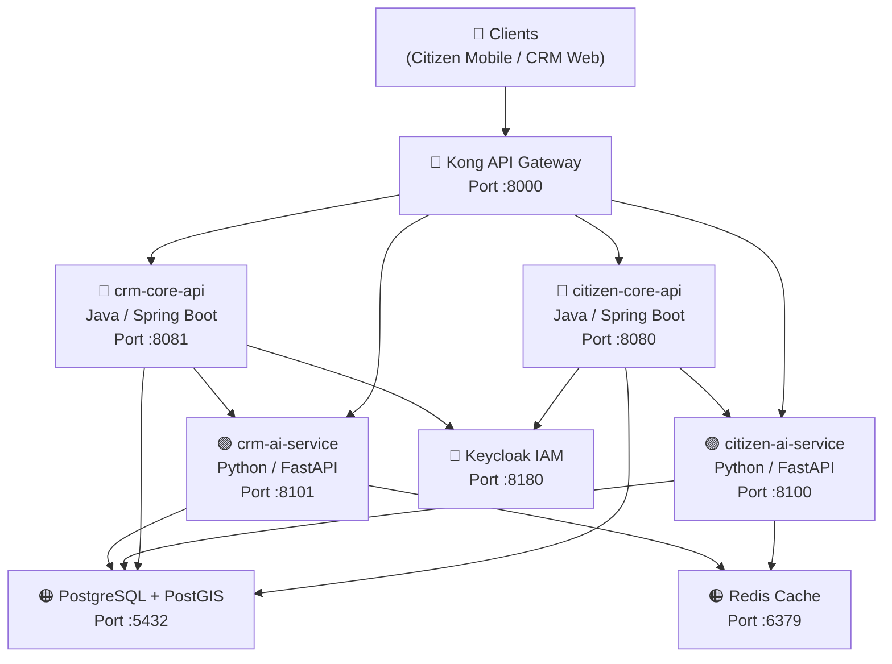

# RoadWatch — Backend Grievance & Budget Transparency Platform

RoadWatch is a high-integrity, real-time civic grievance routing and budget transparency backend. It integrates spatial query engines, role-scoped row-level security, OIDC identity management, API gateway proxies, and automated AI helpers.

---

## 1. System Architecture & Port Map

All services run inside a containerized network bridge (`roadwatch-net`):



| Service | Port | Endpoint Prefix | Purpose |
|---|---|---|---|
| **Kong Gateway** | `8000` | `/api/v1/` | API routing proxy, Redis-backed rate limiting, CORS |
| **Keycloak** | `8180` | `/realms/roadwatch` | IAM OAuth2 OIDC identity provider |
| **PostgreSQL** | `5432` | — | Relational database + PostGIS spatial extension |
| **Redis** | `6379` | — | rate-limit counters & chatbot session cache |
| **citizen-core-api** | `8080` | `/api/v1/citizen` | Spring Boot: ticket creation, clustering, offline sync, WebSockets |
| **crm-core-api** | `8081` | `/api/v1/crm` | Spring Boot: RLS-scoped ticket list, workorders, and budgets |
| **citizen-ai-service**| `8100` | `/api/v1/ai/citizen` | FastAPI: AI chatbot agent, spatial containment geo-routing, spam check |
| **crm-ai-service** | `8101` | `/api/v1/ai/crm` | FastAPI: Officer chat assistant, SLA predictor cron, PoW photo checker, PDF gen |

---

## 2. Core Mechanics (In-Depth Reference)

### 2.1 Spatial Clustering (50m Radius Centroid Shifting)
*   **Location**: `citizen-core-api` — `TicketService.java`
*   **Logic**: When a citizen submits a report, the backend queries PostGIS via `ST_DWithin` geography for open tickets of the same category within a 50m radius.
*   **Clustering**: If found, the report is saved as a `TicketContribution` linked to the original `MasterTicket`. The master's `contributorCount` increments. If count reaches 5+, priority auto-upgrades to `HIGH`. If not found, a new `MasterTicket` is created.

### 2.2 Relational Row-Level Security (RLS)
*   **Location**: `crm-core-api` — `MasterTicketRepository.java`
*   **Logic**: Verifies that division officers only query tickets matching their division tree coordinates.
*   **JE/EE**: Restricted strictly to their `jurisdictionId` boundaries (Ward 42).
*   **SE/CE**: Extended to query their division tree, retrieving child node tickets through recursive subqueries.

### 2.3 Conversational AI Agent & Mock Fallbacks
*   **Location**: `citizen-ai-service` & `crm-ai-service` — `app/clients/llm_client.py`
*   **Integration**: Utilizes official OpenAI client libraries with `gpt-4o-mini` templates.
*   **Resilience Fallback**: If `OPENAI_API_KEY` is blank or calls fail, the client gracefully switches to a **Local Heuristic Mode** using keyphrase scanners to trigger structured OIDC tool calls (e.g. `submit_complaint`), ensuring the backend can be tested offline.

### 2.4 SLA Scan Background Cron
*   **Location**: `crm-ai-service` — `app/jobs/sla_scanner.py`
*   **Logic**: Runs every 30 minutes via an `APScheduler` worker. Directly queries the shared Postgres database for tickets in `OPEN` or `ASSIGNED` state whose `sla_deadline < now + 48h`. Re-routes tickets to parent role `EE` via `/tickets/{id}/escalate` path.

### 2.5 Proof-of-Work Validator
*   **Location**: `crm-ai-service` — `app/services/pow_service.py`
*   **Logic**: Compares coordinates distance. If GPS coordinates of the uploaded contractor repair photo differ by > 200m from the ticket location, it triggers a `location_match: false` and overall `REJECTED` verdict.

### 2.6 ReportLab Utilization Certificate (UC) PDF Generator
*   **Location**: `crm-ai-service` — `app/services/uc_service.py`
*   **Logic**: Generates a GFR 12-A form using reportlab paragraph layouts and styles, writing it to `static/uc/uc-{wo_id}.pdf`.

---

## 3. Development Setup & Launch

### Prerequisites
Create a `.env` file in the root directory:
```env
OPENAI_API_KEY=your_openai_api_key_here
```
*(Leave blank to run the entire backend fully offline using AI fallback loops).*

### Build and Launch the Stack
```bash
docker-compose up --build -d
```

### Initial Seed Data
Keycloak will automatically import the realm configurations. Postgres will run Flyway migrations creating tables and seeding default metrics.

**Seeded Users (Credentials: Password `dev123` for all)**:
*   `officer_je` (Junior Engineer, Ward 42) — ID: `447192dc-e3a5-4e78-bc4a-9eb4c5c76ab1`
*   `officer_ee` (Executive Engineer, Chennai Division) — ID: `b9b9a674-ec0a-4fb4-bbab-fb605eb8716b`
*   `contractor_1` (Apex Infrastructure)

---

## 4. Run Automated Test Suites

Both Java services use **JUnit 5** and PyTest is integrated inside both FastAPI services:

```bash
# 1. citizen-core-api
cd citizen-core-api && mvn test

# 2. crm-core-api
cd ../crm-core-api && mvn test

# 3. citizen-ai-service
cd ../citizen-ai-service && pytest

# 4. crm-ai-service
cd ../crm-ai-service && pytest
```
