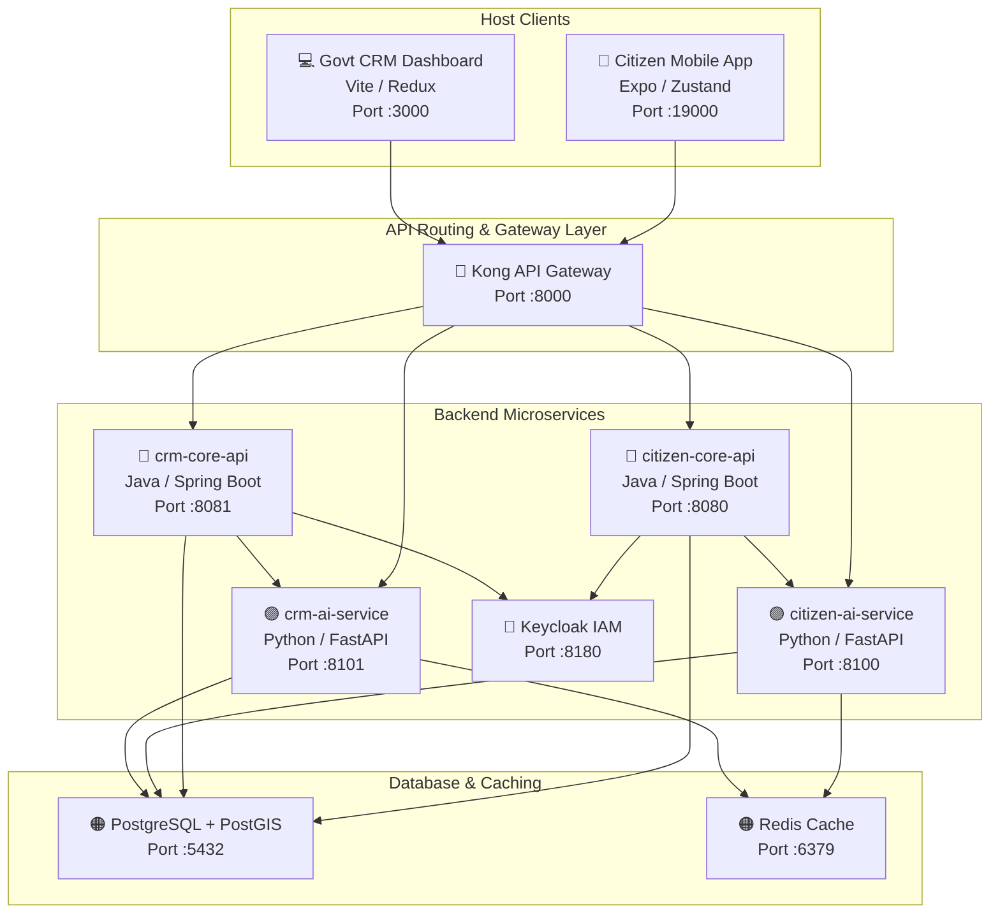

# RoadWatch — Grievance, Spatial Routing, & Budget Transparency Platform

RoadWatch is a high-integrity civic grievance routing and budget transparency platform. It integrates spatial query engines, role-scoped row-level security, OIDC identity management, API gateway proxies, automated AI helpers, and **two full-stack frontend applications** equipped with comprehensive test suites.

---

## 1. System Architecture & Port Map

All services run inside containerized bridge network layers (`roadwatch-net`), with clients running on the host system:



### Complete Port Mapping Reference

| Service / App | Platform / Lang | Port | Endpoint Prefix | Purpose |
|---|---|---|---|---|
| **Citizen App** | Expo / React Native | `19000` | — | Mobile client: offline-first complaint saves, chat assistant, leaflet WebView maps |
| **Govt CRM** | React / Vite | `3000` | — | Dashboard client: RLS backlog grid, split-pane computer vision PoW validations, MSW mock worker |
| **Kong Gateway** | Kong 3.7 | `8000` | `/api/v1/` | Routing proxy, Redis rate-limiting, CORS handling |
| **Keycloak** | Keycloak 25 | `8180` | `/realms/roadwatch` | IAM OAuth2 OIDC identity provider (SSO) |
| **PostgreSQL** | PostgreSQL 16 + PostGIS | `5432` | — | Relational database + spatial queries |
| **Redis** | Redis 7 | `6379` | — | Chatbot session caching & rate-limit counters |
| **citizen-core-api** | Java 21 / Spring Boot 3.3 | `8080` | `/api/v1/citizen` | Spring Boot: ticket creation, spatial clustering, offline sync, WebSockets STOMP broker |
| **crm-core-api** | Java 21 / Spring Boot 3.3 | `8081` | `/api/v1/crm` | Spring Boot: RLS-scoped ticket list, workorders, and budget schemes |
| **citizen-ai-service**| Python 3.12 / FastAPI | `8100` | `/api/v1/ai/citizen` | FastAPI: AI chatbot, spatial containment routing, spam checks |
| **crm-ai-service** | Python 3.12 / FastAPI | `8101` | `/api/v1/ai/crm` | FastAPI: SLA predictor cron, PoW photo checks, ReportLab PDF UCs |

---

## 2. Core Mechanics (In-Depth Reference)

### 2.1 Spatial Clustering (50m Radius Centroid Shifting)
*   **Location**: `citizen-core-api` — `TicketService.java`
*   **Logic**: Query PostGIS via `ST_DWithin` geography for open tickets of the same category within 50m. If found, save report as a `TicketContribution` linked to the original `MasterTicket`. If count reaches 5+, priority auto-upgrades to `HIGH`. Otherwise, create a new `MasterTicket`.

### 2.2 Relational Row-Level Security (RLS)
*   **Location**: `crm-core-api` — `MasterTicketRepository.java`
*   **Logic**: Verifies that division officers only query tickets matching their division tree coordinates. Wards JEs are restricted to Ward 42 boundaries. SEs/CEs query child node tickets through recursive subqueries.

### 2.3 Offline-First Sync Queue
*   **Location**: `citizen-app` — `syncQueueStore.ts` & `useOfflineSyncController.ts`
*   **Logic**: When a mobile user is offline, submissions are saved to a Zustand queue store serialized to disk (`AsyncStorage`). A NetInfo listener detects cellular/WiFi recovery, trigger-replaying actions to `/sync/queue` endpoints.

### 2.4 double-pane Computer Vision PoW Scanning
*   **Location**: `crm-web` — `ProofViewer.tsx` & `usePoWValidationController.ts`
*   **Logic**: Compares coordinates distance. If GPS coordinates of the uploaded contractor repair photo differ by > 200m from the ticket location, it triggers a `location_match: false` and overall `REJECTED` verdict. The UI displays an active scanning visual during FastAPI computer vision analysis.

### 2.5 RoleGuard structural access masking
*   **Location**: `crm-web` — `RoleGuard.tsx`
*   **Logic**: Wraps interactive visual components structurally based on decrypted Keycloak JWT roles (e.g. JE is restricted from manual escalations or fund release buttons).

---

## 3. Development Setup & Launch

### Prerequisites
Create a `.env` file in the root directory:
```env
OPENAI_API_KEY=your_openai_api_key_here
```
*(Leave blank to run the entire backend fully offline using AI fallback loops).*

### 3.1 Spin up the Backend Stack
```bash
docker-compose up --build -d
```
Keycloak Realm config imports and Postgres Flyway migrations run automatically on launch.
*   **JE Credentials**: Phone login via app OR `officer_je` (Password: `dev123`)
*   **EE Credentials**: SSO login via CRM web portal OR `officer_ee` (Password: `dev123`)

### 3.2 Spin up the Frontend Applications

#### A. Govt CRM Web Dashboard
```bash
cd crm-web
npm install
npm run dev
```
Open [http://localhost:3000](http://localhost:3000). (The Mock Service Worker MSW is active by default to support stand-alone testing. Use OIDC SSO credentials token `developer-jwt-token-claims` to sign in instantly).

#### B. Citizen Mobile Client
```bash
cd ../citizen-app
npm install
npm run start
```
Launch Expo CLI on host to preview app tabs (explore map grid, offline sync indicators, file grievances, AI chatbot streaming).

---

## 4. Run Automated Test Suites

### 4.1 Backend Test Suites
```bash
# 1. citizen-core-api (JUnit 5)
cd citizen-core-api && mvn test

# 2. crm-core-api (JUnit 5)
cd ../crm-core-api && mvn test

# 3. citizen-ai-service (PyTest)
cd ../citizen-ai-service && pytest

# 4. crm-ai-service (PyTest)
cd ../crm-ai-service && pytest
```

### 4.2 Frontend Test Suites

#### A. crm-web Dashboard (Vitest & Playwright)
```bash
cd ../crm-web
# Run Unit & React Component Integration tests:
npm run test

# Run E2E Headless Chrome Browser tests:
npx playwright test
```

#### B. citizen-app Mobile Client (Jest & Maestro)
```bash
cd ../citizen-app
# Run Unit & Custom Hook Integration tests:
npm test

# Run mobile E2E device automation:
maestro test .maestro/offline_complaint_flow.yaml
```
