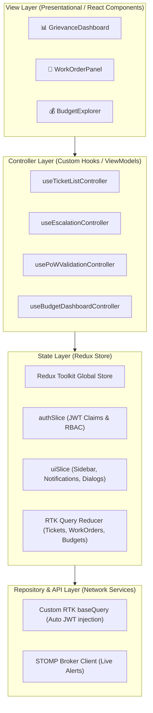
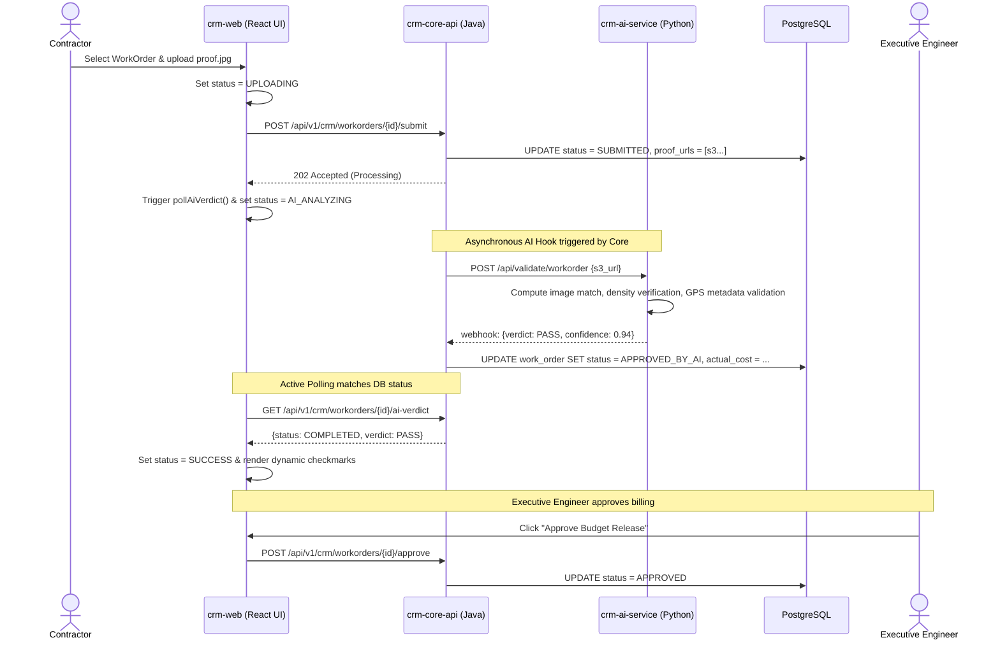

# LLD — React (TypeScript) · RoadWatch Govt CRM Portal

> **Service**: `crm-web` | **Lang/Framework**: TypeScript, React 18 + Vite  
> **Owns**: Officer grievance dashboard, Role-Based Access Control (RBAC), SLA Breach tracking, Work Order issuance, Proof-of-Work (PoW) verification, Utilization Certificate (UC) PDF generation  
> **State Management**: Redux Toolkit (Client UI & Session) + RTK Query (Server State Cache)  
> **Network/API Layer**: RTK Query (Axios-free fetch wrapper), WebSocket (STOMP Broker client)

---

## 1. Architecture Position

The **Govt CRM Portal** is the centralized management dashboard used by government engineers (JE, AE, EE, SE, CE), administrative heads, and third-party contractors. It communicates with the `crm-core-api` (Java) and `crm-ai-service` (Python) through the **Kong API Gateway**.



### Architectural Principles
1. **Unidirectional UI Hook Handoff**: Views bind directly to custom controller hooks. The component remains entirely presentational—receiving read-only lists and emitting atomic event callbacks.
2. **Tag-Based Cache Invalidation**: RTK Query acts as the data repository, using a strict cache invalidation model (e.g. mutating a `WorkOrder` automatically invalidates the `Tickets` tag, triggering automatic background re-fetch).
3. **JWT-Driven Role Security**: The authentication slice (`authSlice`) processes Keycloak's access token, extracting custom claims: `role`, `jurisdiction_id`, and `authority_type`. Access to interactive elements is declared structurally using visual guards.

---

## 2. Directory Structure

The structure segregates the visual representation (Components) from the state machine logic (Slices) and orchestration hooks (Controllers):

```
crm-web/
├── src/
│   ├── api/                        # Repository / API Layer
│   │   ├── baseQuery.ts            # Custom fetchBaseQuery with JWT insertion and auto-refresh
│   │   ├── ticketApi.ts            # RTK Query endpoints for ticket management
│   │   ├── workorderApi.ts         # RTK Query endpoints for contractors & work orders
│   │   └── budgetApi.ts            # RTK Query endpoints for budget allocation queries
│   ├── state/                      # State Layer (Redux Toolkit)
│   │   ├── store.ts                # Redux store config
│   │   └── slices/
│   │       ├── authSlice.ts        # Extract custom JWT scopes (JE/AE/EE/SE/CE)
│   │       └── uiSlice.ts          # Alert banners, notifications queue, modal states
│   ├── controllers/                # Controller Layer (React Hooks ViewModels)
│   │   ├── useTicketListController.ts # Custom sorting, status filtering, batch assignments
│   │   ├── useEscalationController.ts # SLA alerts, predictor logic integration
│   │   ├── usePoWValidationController.ts # File uploads & validation state polling
│   │   └── useBudgetDashboardController.ts # Scheme budget utilization mappings
│   ├── components/                 # View Layer (CSS Layouts & Widgets)
│   │   ├── common/
│   │   │   ├── RoleGuard.tsx       # Structural component wrapping unauthorized views
│   │   │   └── GlassCard.tsx       # Reusable CSS styled background panel
│   │   ├── tickets/
│   │   │   ├── TicketTableRow.tsx
│   │   │   └── EscalateButton.tsx
│   │   ├── workorders/
│   │   │   ├── ProofViewer.tsx     # Double pane split screen (Contractor submission vs AI analysis)
│   │   │   └── WorkOrderForm.tsx
│   │   └── layout/
│   │       ├── DashboardLayout.tsx # Main frame with sidebar
│   │       └── LiveNotificationToast.tsx
│   ├── assets/                     # Shared styles, branding SVGs, variables
│   │   └── main.css                # Base styling & animations
│   └── App.tsx                     # Routing configuration & Redux Providers
├── package.json
├── vite.config.ts
└── tsconfig.json
```

---

## 3. Data & API Layer Definitions

### 3.1 Custom Keycloak Claims & Redux Auth State

Authentication details are decrypted on the client to enforce UI capability restrictions.

```typescript
// src/state/slices/authSlice.ts
import { createSlice, PayloadAction } from '@reduxjs/toolkit';
import { jwtDecode } from 'jwt-decode';

export type OfficerRole = 'JE' | 'AE' | 'EE' | 'SE' | 'CE' | 'CONTRACTOR' | 'COMMISSIONER';

export interface KeycloakTokenPayload {
  sub: string;
  name: string;
  email?: string;
  roles: OfficerRole[];
  jurisdiction_id: string;
  authority_type: 'MUNICIPAL' | 'PWD' | 'NHAI' | 'BRO' | 'PMGSY' | 'FOREST';
}

interface AuthState {
  token: string | null;
  user: KeycloakTokenPayload | null;
  isAuthenticated: boolean;
}

const initialState: AuthState = {
  token: null,
  user: null,
  isAuthenticated: false,
};

const authSlice = createSlice({
  name: 'auth',
  initialState,
  reducers: {
    setCredentials: (state, action: PayloadAction<{ token: string }>) => {
      const decoded: KeycloakTokenPayload = jwtDecode(action.payload.token);
      state.token = action.payload.token;
      state.user = decoded;
      state.isAuthenticated = true;
    },
    logout: (state) => {
      state.token = null;
      state.user = null;
      state.isAuthenticated = false;
    }
  }
});

export const { setCredentials, logout } = authSlice.actions;
export default authSlice.reducer;
```

### 3.2 RTK Query API Service (`ticketApi.ts`)

Defines REST routes, mapping standard queries to custom cache tags for instant reactive UI updates.

```typescript
// src/api/ticketApi.ts
import { createApi } from '@reduxjs/toolkit/query/react';
import { baseQueryWithReauth } from './baseQuery';
import { Ticket, TicketStatus, TicketEvent } from '../types';

export const ticketApi = createApi({
  reducerPath: 'ticketApi',
  baseQuery: baseQueryWithReauth,
  tagTypes: ['Tickets', 'TicketEvents'],
  endpoints: (builder) => ({
    getTickets: builder.query<Ticket[], { status?: TicketStatus; limit?: number }>({
      query: (params) => ({
        url: '/tickets',
        method: 'GET',
        params,
      }),
      providesTags: (result) =>
        result
          ? [...result.map(({ id }) => ({ type: 'Tickets' as const, id })), { type: 'Tickets', id: 'LIST' }]
          : [{ type: 'Tickets', id: 'LIST' }],
    }),
    assignTicket: builder.mutation<Ticket, { id: string; assignedTo: string }>({
      query: ({ id, assignedTo }) => ({
        url: `/tickets/${id}/assign`,
        method: 'PATCH',
        body: { assignedTo },
      }),
      invalidatesTags: (result, error, { id }) => [{ type: 'Tickets', id }],
    }),
    escalateTicket: builder.mutation<TicketEvent, { id: string; reason: string }>({
      query: ({ id, reason }) => ({
        url: `/tickets/${id}/escalate`,
        method: 'POST',
        body: { reason },
      }),
      // Invalidating BOTH lists and timelines triggers automatic refresh
      invalidatesTags: (result, error, { id }) => [
        { type: 'Tickets', id },
        { type: 'TicketEvents', id: `LIST_${id}` }
      ],
    })
  })
});

export const { useGetTicketsQuery, useAssignTicketMutation, useEscalateTicketMutation } = ticketApi;
```

---

## 4. Controller Layer Implementation (The Business Logic)

Controllers act as ViewModels. They consume RTK Query and dispatch local Redux actions, exposing clear APIs to the UI panels.

### 4.1 Ticket List Controller (`useTicketListController.ts`)
Decouples grid components from search indices, jurisdictional limits, and mutations.

```typescript
// src/controllers/useTicketListController.ts
import { useState, useMemo } from 'react';
import { useGetTicketsQuery, useAssignTicketMutation } from '../api/ticketApi';
import { useSelector } from 'react-redux';
import { RootState } from '../state/store';

export const useTicketListController = () => {
  const currentUser = useSelector((state: RootState) => state.auth.user);
  
  // Local reactive states for filters
  const [searchTerm, setSearchTerm] = useState('');
  const [selectedStatus, setSelectedStatus] = useState<string>('ALL');

  // Trigger query hook (auto fetches on load or when filter parameters modify)
  const { data: tickets = [], isLoading, error } = useGetTicketsQuery(
    selectedStatus === 'ALL' ? {} : { status: selectedStatus as any }
  );

  const [assignTicket, { isLoading: isAssigning }] = useAssignTicketMutation();

  // Perform client-side calculations (sorting, text search match)
  const filteredTickets = useMemo(() => {
    return tickets
      .filter((ticket) => {
        const matchesSearch = 
          ticket.title.toLowerCase().includes(searchTerm.toLowerCase()) ||
          ticket.id.toLowerCase().includes(searchTerm.toLowerCase());
        
        // Implicit Row-Level Security: Only display tickets matching officer's jurisdiction scope
        const matchesJurisdiction = currentUser?.roles.includes('CE') 
          ? true // CE has master administrative scope
          : ticket.jurisdictionId === currentUser?.jurisdiction_id;

        return matchesSearch && matchesJurisdiction;
      })
      .sort((a, b) => new Date(b.updatedAt).getTime() - new Date(a.updatedAt).getTime());
  }, [tickets, searchTerm, currentUser]);

  const handleAssignment = async (ticketId: string, officerId: string) => {
    try {
      await assignTicket({ id: ticketId, assignedTo: officerId }).unwrap();
    } catch (err) {
      console.error('Assignment mutation failed:', err);
    }
  };

  return {
    tickets: filteredTickets,
    isLoading,
    error,
    searchTerm,
    setSearchTerm,
    selectedStatus,
    setSelectedStatus,
    assignOfficer: handleAssignment,
    isAssigning
  };
};
```

### 4.2 Work Order AI Validation Controller (`usePoWValidationController.ts`)
Deals with the highly complex, asynchronous, multi-step flow of uploading contractors' proof photos, validating with `crm-ai-service`, polling, and updating states.

```typescript
// src/controllers/usePoWValidationController.ts
import { useState } from 'react';
import { useSubmitProofMutation, useGetWorkOrderQuery } from '../api/workorderApi';

export const usePoWValidationController = (workOrderId: string) => {
  const { data: workOrder, isLoading: isLoadingWO } = useGetWorkOrderQuery(workOrderId);
  const [submitProof] = useSubmitProofMutation();

  const [validationProgress, setValidationProgress] = useState<'IDLE' | 'UPLOADING' | 'AI_ANALYZING' | 'SUCCESS' | 'FAILED'>('IDLE');
  const [aiAnalysisVerdict, setAiAnalysisVerdict] = useState<string | null>(null);

  const handleProofSubmission = async (file: File) => {
    try {
      setValidationProgress('UPLOADING');
      
      // 1. Upload proof file via mutation (sends multi-part binary to core API)
      const uploadResponse = await submitProof({ id: workOrderId, file }).unwrap();
      
      setValidationProgress('AI_ANALYZING');
      
      // 2. Poll validation results from background AI agent analysis
      pollAiVerdict(workOrderId);
    } catch (err) {
      setValidationProgress('FAILED');
    }
  };

  const pollAiVerdict = (id: string) => {
    let attempts = 0;
    const interval = setInterval(async () => {
      attempts++;
      try {
        const response = await fetch(`/api/v1/crm/workorders/${id}/ai-verdict`);
        const data = await response.json();
        
        if (data.status === 'COMPLETED') {
          clearInterval(interval);
          setValidationProgress(data.verdict === 'PASS' ? 'SUCCESS' : 'FAILED');
          setAiAnalysisVerdict(data.reason || 'AI analysis completed.');
        }
      } catch (e) {
        if (attempts > 10) {
          clearInterval(interval);
          setValidationProgress('FAILED');
          setAiAnalysisVerdict('AI timed out.');
        }
      }
    }, 2000);
  };

  return {
    workOrder,
    isLoading: isLoadingWO,
    submitProof: handleProofSubmission,
    status: validationProgress,
    aiVerdict: aiAnalysisVerdict
  };
};
```

---

## 5. Work Order & AI Validation Pipeline

This pipeline details how contractor proof-of-work (PoW) photo uploads are verified asynchronously by the `crm-ai-service` (Python Computer Vision model) and integrated back into the core database states:



---

## 6. Role Guards & Navigation Security

Routing and UI capabilities are structurally guarded. Visual components use `<RoleGuard>` elements to gracefully hide restricted buttons:

```typescript
// src/components/common/RoleGuard.tsx
import React from 'react';
import { useSelector } from 'react-redux';
import { RootState } from '../../state/store';
import { OfficerRole } from '../../state/slices/authSlice';

interface RoleGuardProps {
  allowed: OfficerRole[];
  children: React.ReactNode;
  fallback?: React.ReactNode;
}

export const RoleGuard: React.FC<RoleGuardProps> = ({ allowed, children, fallback = null }) => {
  const currentUser = useSelector((state: RootState) => state.auth.user);

  // Check if current user has any of the required scopes
  const hasAccess = currentUser?.roles.some((role) => allowed.includes(role));

  if (!hasAccess) {
    return <>{fallback}</>;
  }

  return <>{children}</>;
};
```

---

## 7. Premium Visual Dashboard Styles (CSS)

The CSS dashboard implementation relies on a curated typography scale and harmonized glassmorphism design parameters:

```css
/* src/assets/main.css */
:root {
  --font-sans: 'Outfit', sans-serif;
  --bg-dark: #070a13;
  --panel-glass: rgba(20, 26, 48, 0.4);
  --border-glass: rgba(255, 255, 255, 0.05);
  
  --accent-neon: #3b82f6;
  --warning-neon: #eab308;
  --success-neon: #10b981;
}

body {
  background-color: var(--bg-dark);
  font-family: var(--font-sans);
  color: #f3f4f6;
  margin: 0;
}

/* Glassmorphic Panel Cards with subtle micro-animations */
.glass-panel {
  background: var(--panel-glass);
  backdrop-filter: blur(12px);
  border: 1px solid var(--border-glass);
  border-radius: 16px;
  padding: 24px;
  transition: transform 0.2s ease, border-color 0.2s ease;
}

.glass-panel:hover {
  transform: translateY(-2px);
  border-color: rgba(59, 130, 246, 0.25);
  box-shadow: 0 10px 25px -5px rgba(0, 0, 0, 0.5);
}
```

---

## 8. Key Dependencies

The CRM web dashboard leverages Redux Toolkit and modern rendering packages:

```json
{
  "dependencies": {
    "react": "^18.3.1",
    "react-dom": "^18.3.1",
    "@reduxjs/toolkit": "^2.2.3",
    "react-redux": "^9.1.2",
    "react-router-dom": "^6.23.0",
    "jwt-decode": "^4.0.0",
    "chart.js": "^4.4.2",
    "react-chartjs-2": "^5.2.0",
    "lucide-react": "^0.378.0",
    "@stomp/stompjs": "^7.0.0"
  },
  "devDependencies": {
    "vite": "^5.2.11",
    "typescript": "^5.2.2"
  }
}
```
