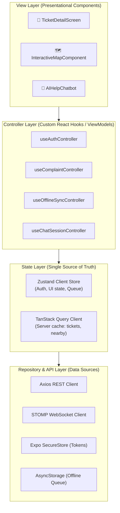
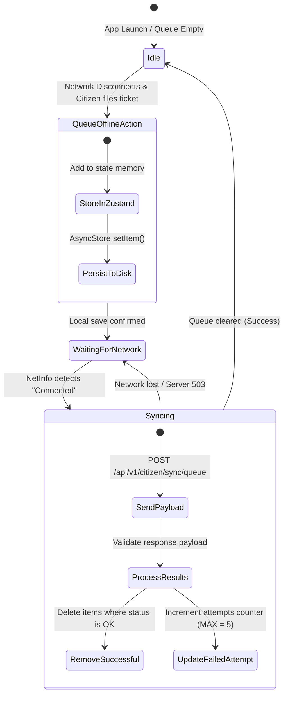

# LLD — React Native (Expo) · RoadWatch Citizen App

> **Service**: `citizen-app` | **Lang/Framework**: TypeScript, React Native + Expo SDK 51  
> **Owns**: Complaint Creation, Offline Queue & Replay, Live Ticket Tracking, Citizen AI Chatbot interface, Open Budgets explorer  
> **State Management**: Zustand (Client/Offline State) + TanStack Query v5 (Server Cache)  
> **Network/API Layer**: Axios (HTTP), Native EventSource (SSE), `@stomp/stompjs` (WebSockets)

---

## 1. Architecture Position

The **RoadWatch Citizen App** operates as a client-side mobile application. It interacts with the backend services through the **Kong API Gateway**. The app is designed using a strict **Model-View-ViewModel (MVVM) Hooks-driven Clean Architecture** to fully decouple UI styling from network, storage, and state management.



### Architectural Principles
1. **Zero Raw Fetching in Views**: Components *never* make direct Axios calls or select state directly from raw storage. They interact solely through **Controller Hooks**.
2. **Deterministic Controller Interface**: Controllers expose a clean, type-safe API containing read-only state (e.g., `tickets`, `isLoading`) and trigger methods (e.g., `submitComplaint`, `retrySync`).
3. **Separate State Concerns**:
   - **Server State**: Server-backed data (e.g. ticket history, budgets) is owned by **TanStack Query** (handles automatic caching, invalidation, and background updates).
   - **Client State**: Local UI state, authentication tokens, and the **Offline Sync Queue** are owned by **Zustand** stores with persistent adapters.

---

## 2. Directory Structure

The project layout mirrors the MVVM design system, ensuring a clean boundary between visual layers and architectural logic:

```
citizen-app/
├── src/
│   ├── api/                        # Repository / API Layer
│   │   ├── client/
│   │   │   └── apiClient.ts        # Axios base config, OIDC token injection, 401 handling
│   │   ├── services/
│   │   │   ├── ticketApi.ts        # REST requests for /tickets, /nearby, /clusters
│   │   │   ├── chatApi.ts          # REST requests for AI chatbot
│   │   │   └── budgetApi.ts        # Budget queries
│   │   └── websocket/
│   │       └── socketClient.ts     # STOMP WebSocket connection wrapper
│   ├── state/                      # State Layer (Stores)
│   │   ├── authStore.ts            # Zustand auth state
│   │   ├── syncQueueStore.ts       # Zustand offline queue manager (Persisted)
│   │   └── queryClient.ts          # TanStack Query standard config
│   ├── controllers/                # Controller Layer (Business Logic Hooks)
│   │   ├── useAuthController.ts    # Biometrics & login lifecycle
│   │   ├── useComplaintController.ts # Geo-mapping, filtering, submission orchestration
│   │   ├── useChatSessionController.ts # SSE streams, LLM dialogue, auto-tool triggers
│   │   └── useOfflineSyncController.ts # NetInfo connection listener & queue replay state machine
│   ├── components/                 # View Layer (UI - CSS styling & UI controls)
│   │   ├── common/                 # Buttons, inputs, modals
│   │   ├── map/
│   │   │   ├── InteractiveMap.tsx  # Maps ticket markers and clustering
│   │   │   └── GeoPicker.tsx
│   │   ├── ticket/
│   │   │   └── EventTimeline.tsx   # Visual status history
│   │   └── chat/
│   │       └── ChatWindow.tsx      # Stream rendering & Markdown support
│   └── navigation/
│       └── AppNavigator.tsx        # React Navigation routing & guard structures
├── App.tsx                         # App Entry point (Context providers wrapper)
├── app.json                        # Expo app config
└── tsconfig.json
```

---

## 3. Data & API Layer Definitions

### 3.1 Domain TypeScript Interfaces (Model)

```typescript
// src/api/types.ts

export type TicketCategory = 'POTHOLE' | 'LIGHTING' | 'SIGNAGE' | 'ROAD_QUALITY' | 'OTHER';
export type TicketStatus = 'OPEN' | 'ASSIGNED' | 'IN_PROGRESS' | 'RESOLVED' | 'ESCALATED' | 'CLOSED';
export type TicketPriority = 'NORMAL' | 'HIGH' | 'BLACKSPOT';
export type AuthorityType = 'MUNICIPAL' | 'PWD' | 'NHAI' | 'BRO' | 'PMGSY' | 'FOREST';

export interface LocationPoint {
  latitude: number;
  longitude: number;
}

export interface Ticket {
  id: string;
  title: string;
  description: string;
  status: TicketStatus;
  priority: TicketPriority;
  category: TicketCategory;
  location: LocationPoint;
  photoUrls: string[];
  contributorCount: number;
  jurisdictionId: string;
  authorityType: AuthorityType;
  slaDeadline: string; // ISO DateTime
  createdAt: string;
  updatedAt: string;
}

export interface TicketEvent {
  id: string;
  ticketId: string;
  actorId: string;
  eventType: 'CREATED' | 'ASSIGNED' | 'COMMENTED' | 'ESCALATED' | 'RESOLVED' | 'CLOSED';
  payload: Record<string, any>;
  timestamp: string;
}

export interface SyncAction {
  id: string; // UUID
  type: 'CREATE_TICKET' | 'CONTRIBUTE';
  payload: any;
  timestamp: string;
  attempts: number;
}
```

### 3.2 Global State Definition (Zustand & React Query)

```typescript
// src/state/authStore.ts
import { create } from 'zustand';
import * as SecureStore from 'expo-secure-store';

interface AuthState {
  accessToken: string | null;
  refreshToken: string | null;
  isAuthenticated: boolean;
  user: { id: string; phone: string; name: string } | null;
  setTokens: (access: string, refresh: string, userPayload: any) => Promise<void>;
  clearAuth: () => Promise<void>;
}

export const useAuthStore = create<AuthState>((set) => ({
  accessToken: null,
  refreshToken: null,
  isAuthenticated: false,
  user: null,
  setTokens: async (access, refresh, userPayload) => {
    await SecureStore.setItemAsync('access_token', access);
    await SecureStore.setItemAsync('refresh_token', refresh);
    set({ accessToken: access, refreshToken: refresh, isAuthenticated: true, user: userPayload });
  },
  clearAuth: async () => {
    await SecureStore.deleteItemAsync('access_token');
    await SecureStore.deleteItemAsync('refresh_token');
    set({ accessToken: null, refreshToken: null, isAuthenticated: false, user: null });
  }
}));
```

---

## 4. Controller Layer Implementation (The Business Logic)

Controllers coordinate State and Repositories. Views import these hooks to query state and trigger actions.

### 4.1 Ticket Controller (`useComplaintController.ts`)
Decouples UI screens (e.g. `FileComplaintScreen`) from API fetching, offline queues, and state mutation.

```typescript
// src/controllers/useComplaintController.ts
import { useMutation, useQuery, useQueryClient } from '@tanstack/react-query';
import { ticketApi } from '../api/services/ticketApi';
import { useSyncQueueStore } from '../state/syncQueueStore';
import { useAuthStore } from '../state/authStore';
import NetInfo from '@react-native-community/netinfo';
import { TicketCategory, LocationPoint } from '../api/types';

export const useComplaintController = () => {
  const queryClient = useQueryClient();
  const queueAction = useSyncQueueStore((state) => state.queueAction);
  const isAuthenticated = useAuthStore((state) => state.isAuthenticated);

  // 1. Fetch nearby tickets (Server State)
  const useNearbyTickets = (coords: LocationPoint, radiusMeters: number = 1000) => {
    return useQuery({
      queryKey: ['tickets', 'nearby', coords.latitude, coords.longitude, radiusMeters],
      queryFn: () => ticketApi.fetchNearby(coords.latitude, coords.longitude, radiusMeters),
      enabled: !!coords.latitude && !!coords.longitude,
      staleTime: 1000 * 60 * 5, // 5 minutes stale time
    });
  };

  // 2. Submit Complaint Mutation (handles Offline fallback transparently)
  const submitComplaintMutation = useMutation({
    mutationFn: async (payload: {
      category: TicketCategory;
      description: string;
      location: LocationPoint;
      photoUrls: string[];
      isAnonymous: boolean;
    }) => {
      const netInfo = await NetInfo.fetch();
      
      if (!netInfo.isConnected) {
        // Offline → Push to Zustand persistent queue
        await queueAction({
          id: Math.random().toString(36).substring(7),
          type: 'CREATE_TICKET',
          payload,
          timestamp: new Date().toISOString(),
          attempts: 0
        });
        throw new Error('OFFLINE_QUEUE_TRIGGERED');
      }

      return ticketApi.createTicket(payload);
    },
    onSuccess: (data) => {
      // Invalidate tickets list to trigger re-fetch on active screens
      queryClient.invalidateQueries({ queryKey: ['tickets'] });
    }
  });

  return {
    useNearbyTickets,
    submitComplaint: submitComplaintMutation.mutateAsync,
    isSubmitting: submitComplaintMutation.isPending,
    submitError: submitComplaintMutation.error,
    isOfflineSave: submitComplaintMutation.error?.message === 'OFFLINE_QUEUE_TRIGGERED'
  };
};
```

### 4.2 Offline Sync Controller (`useOfflineSyncController.ts`)
Implements an autonomous background State Machine. It listens to cellular/WiFi connection transitions and replays the persistent queue actions.

```typescript
// src/controllers/useOfflineSyncController.ts
import { useEffect } from 'react';
import NetInfo from '@react-native-community/netinfo';
import { useSyncQueueStore } from '../state/syncQueueStore';
import { ticketApi } from '../api/services/ticketApi';

export const useOfflineSyncController = () => {
  const { queue, isSyncing, startSync, completeSync, failSync, removeAction } = useSyncQueueStore();

  useEffect(() => {
    // Listen to network state changes
    const unsubscribe = NetInfo.addEventListener((state) => {
      if (state.isConnected && state.isInternetReachable && queue.length > 0 && !isSyncing) {
        triggerReplay();
      }
    });

    return () => unsubscribe();
  }, [queue, isSyncing]);

  const triggerReplay = async () => {
    if (queue.length === 0 || isSyncing) return;
    startSync();

    try {
      // Batch sync queue to backend via the /sync/queue endpoint
      const response = await ticketApi.syncQueue(queue);
      
      // Process result array
      response.forEach((result: { actionId: string; success: boolean; error?: string }) => {
        if (result.success) {
          removeAction(result.actionId);
        } else {
          console.warn(`Sync failed for action ${result.actionId}: ${result.error}`);
          // Action remains in queue for future retry; attempts counter increments automatically
        }
      });
      completeSync();
    } catch (err) {
      failSync(err instanceof Error ? err.message : 'Network sync error');
    }
  };

  return {
    queueLength: queue.length,
    isSyncing,
    triggerManualSync: triggerReplay
  };
};
```

---

## 5. Complex Workflows & Synchronization

### 5.1 Offline Sync State Machine
This diagram outlines how offline actions (such as filing a complaint while stranded in a remote zone with poor reception) are stored locally in the Zustand Store (backed by `AsyncStorage`) and systematically synchronized once connection health returns:



### 5.2 Real-Time Live Ticket Tracker (WebSocket)
Citizens tracking an active high-priority complaint need real-time feedback (e.g. status changes from `OPEN` to `ASSIGNED`). 

The `useTicketWebSocket` controller coordinates raw WebSocket STOMP packets into structured actions, modifying TanStack Query cache parameters dynamically to render local animations:

```typescript
// src/controllers/useTicketWebSocket.ts
import { useEffect } from 'react';
import { useQueryClient } from '@tanstack/react-query';
import { socketClient } from '../api/websocket/socketClient';
import { TicketEvent } from '../api/types';

export const useTicketWebSocket = (ticketId: string) => {
  const queryClient = useQueryClient();

  useEffect(() => {
    if (!ticketId) return;

    // Connect and subscribe to specific STOMP destination
    const destination = `/topic/tickets/${ticketId}`;
    
    const subscription = socketClient.subscribe(destination, (message) => {
      const event: TicketEvent = JSON.parse(message.body);

      // Perform local cache updates matching the event type
      queryClient.setQueryData(['tickets', ticketId], (oldTicket: any) => {
        if (!oldTicket) return oldTicket;
        
        // Dynamically update ticket based on websocket event content
        const updatedTicket = { ...oldTicket };
        if (event.eventType === 'ASSIGNED') {
          updatedTicket.status = 'ASSIGNED';
          updatedTicket.assignedTo = event.payload.assignedTo;
        } else if (event.eventType === 'ESCALATED') {
          updatedTicket.status = 'ESCALATED';
          updatedTicket.priority = 'HIGH';
        } else if (event.eventType === 'RESOLVED') {
          updatedTicket.status = 'RESOLVED';
        }
        
        return updatedTicket;
      });

      // Also force invalidation of active timelines
      queryClient.invalidateQueries({ queryKey: ['tickets', ticketId, 'events'] });
    });

    return () => {
      subscription.unsubscribe();
    };
  }, [ticketId, queryClient]);
};
```

---

## 6. Premium Visual Styles Integration (CSS System)

Since Expo does not run traditional CSS natively, the app maps standard design variables using a theme layer using `React Native StyleSheet` with dynamic HSL inputs to create polished glassy components:

```typescript
// src/components/theme.ts
export const Theme = {
  colors: {
    background: '#0B0F19', // Dark Slate
    cardBg: 'rgba(25, 32, 56, 0.6)', // Glassmorphic translucent Navy
    border: 'rgba(255, 255, 255, 0.08)',
    textPrimary: '#F3F4F6',
    textSecondary: '#9CA3AF',
    accent: '#4F46E5', // Indigo
    success: '#10B981',
    warning: '#F59E0B',
    danger: '#EF4444',
  },
  blur: {
    intensity: 15,
  }
};
```

---

## 7. Key Dependencies

The `package.json` for the citizen client relies on high-performance libraries supporting native thread operations:

```json
{
  "dependencies": {
    "expo": "~51.0.0",
    "react": "18.2.0",
    "react-native": "0.74.1",
    "zustand": "^4.5.2",
    "@tanstack/react-query": "^5.29.2",
    "axios": "^1.6.8",
    "@stomp/stompjs": "^7.0.0",
    "sockjs-client": "^1.6.1",
    "@react-native-async-storage/async-storage": "1.23.1",
    "expo-secure-store": "~13.0.2",
    "@react-native-community/netinfo": "11.3.1",
    "react-native-maps": "1.14.0",
    "i18n-js": "^4.4.3"
  }
}
```
