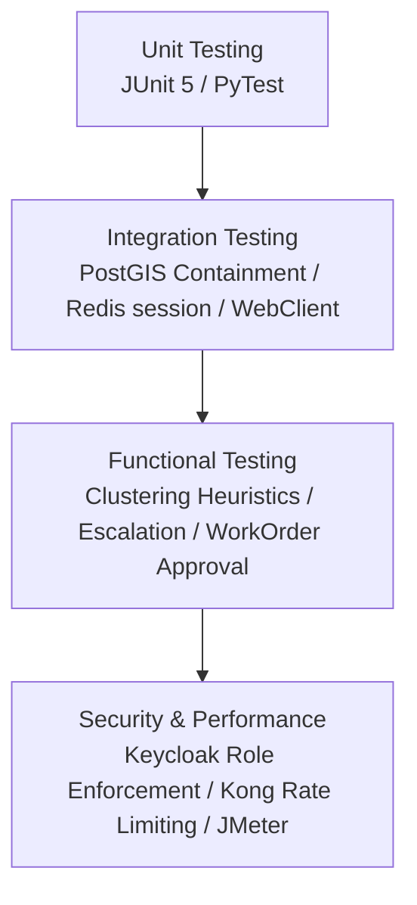

# STLC Stage 2: Test Planning & Strategy Document

## 1. Introduction
This Test Plan defines the strategies, resources, environments, and schedules to thoroughly validate the **RoadWatch Backend Ecosystem** (comprising four back-end services, Postgres/PostGIS, Redis, Kong, and Keycloak).

---

## 2. Test Strategy

### 2.1 Unit Testing (UT)
*   **Java Core Services**: Utilize **JUnit 5**, **Mockito**, and `@SpringBootTest` (with H2 or testcontainers) to validate isolated logic (e.g. centroid coordinate calculations, SLA time increments).
*   **FastAPI Services**: Utilize **PyTest** to check individual utility files (EXIF GPS parsing, ReportLab style mapping coordinates).

### 2.2 Integration Testing (IT)
*   **Database Integration**: Run tests on a local PostGIS container instance to verify `ST_DWithin` and `ST_Contains` spatial query behaviors.
*   **Service-to-Service Integration**: Verify Spring Boot's `WebClient` communications with mock FastAPI routes, checking error mappings and fallback models.

### 2.3 Functional Testing (FT)
*   **MasterTicket Clustering**: Validate the end-to-end flow of posting 5 separate complaints to the same coordinate and checking they append to a single MasterTicket.
*   **bureaucratic Escalation Flow**: Verify the automatic transition of ticket assignments and SLA parameters on simulated SLA breaches.
*   **WorkOrder & Budget Management**: Verify the flow of contractor submissions, validation by the FastAPI PoW checks, and subsequent approval updating both budget utilized balances and ticket states.

### 2.4 Security & Resilience (RBAC + RLS + Failure Modes)
*   **Endpoint Role Verification**: Assert that Keycloak JWT mappings strictly deny cross-role operations.
*   **Row-Level Security Verification**: Test that division and ward officers cannot query tickets or budget records outside their assigned boundary coordinates.
*   **Resilience & Failure Modes (Stage 7)**: Detailed chaos testing of service down states (Keycloak/FastAPI offline), invalid geotag sanitization, database connection spikes, and concurrency race condition resolutions as specified in [07_failure_modes_and_robustness.md](file:///c:/Users/grand/codespace/road-safety-hackathon-2026/docs/STLC_Test_Plan/07_failure_modes_and_robustness.md).

---

## 3. Scope of Testing

### 3.1 In-Scope
*   REST API Endpoint contract validations for all 4 services.
*   PostGIS spatial database query correctness and indexes efficiency.
*   WebSocket STOMP event dispatchers.
*   Offline batch sync replaying logic (`POST /sync/queue`).
*   APScheduler background SLA escalation jobs.
*   PDF generation logic and styling.
*   Kong API gateway rate limiting, CORS configuration, and proxy parameters.

### 3.2 Out-of-Scope
*   Citizen Mobile App UI/UX layout testing (React Native).
*   Officer CRM Dashboard React components rendering verification.
*   Production Cloud deployments (AWS ALB, EKS, Amazon RDS) scaling validations.

---

## 4. Entry and Exit Criteria

### 4.1 Entry Criteria
*   Backend service code builds successfully without compilation errors.
*   Flyway migrations compile and run successfully against Postgres.
*   Docker Compose environment (Postgres, Keycloak, Kong, Redis) is fully initialized and reachable.

### 4.2 Exit Criteria
*   100% of critical-path test cases pass successfully.
*   No severe (Blocker or Critical) bugs remain open.
*   Code coverage metrics exceed 80% on core business modules.
*   Standardized error envelopes are returned across all API surfaces.

---

## 5. Risks and Mitigations

| Risk ID | Description | Severity | Mitigation Plan |
|---|---|---|---|
| **R-001** | OpenAI API connectivity issues or high usage costs during chat execution. | High | Implement comprehensive client-level mock fallbacks that simulate chatbot tools and responses offline. |
| **R-002** | Complex spatial geometry checks slowing down database queries. | Medium | Add database index metrics validations (`GIST` index over geometry columns) in integration test steps. |
| **R-003** | Keycloak server token validation failures during fast testing. | Medium | Configure resource servers with static validation capabilities or use local JSON Web Key Sets (JWKS) mocks. |
