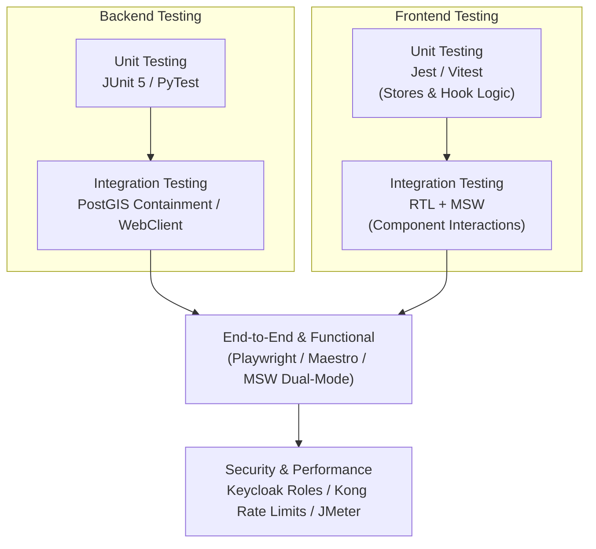

# STLC Stage 2: Test Planning & Strategy Document

## 1. Introduction
This Test Plan defines the strategies, resources, environments, and schedules to thoroughly validate the **RoadWatch Platform**, comprising four backend microservices (Java/Python), Postgres/PostGIS databases, Redis, Kong Gateway, and **two frontend applications**: the **RoadWatch Citizen App** (Expo/React Native) and the **Govt CRM Dashboard** (React + Redux).

---

## 2. Test Strategy

### 2.1 Backend Testing Strategy
*   **Unit Testing (UT)**: Utilize **JUnit 5**, **Mockito**, and `@SpringBootTest` to validate isolated core Java API logic. Utilize **PyTest** to check FastAPI helper utilities (ReportLab/EXIF checks).
*   **Integration Testing (IT)**: Run tests on a local PostGIS container instance to verify `ST_DWithin` and `ST_Contains` spatial query behaviors.

### 2.2 Frontend Testing Strategy
*   **Unit Testing (UT)**: 
    *   **citizen-app**: Validate Zustand store actions (caching tokens, syncing AsyncStorage queues) and mock custom hooks behavior (`useAuthController`, `useComplaintController`) using Jest and `@testing-library/react-native`.
    *   **crm-web**: Verify Redux store slices (`authSlice` JWT parser, toast alerts state) and mapping helper calculations using Vitest.
*   **Integration Testing (IT)**: 
    *   **citizen-app**: Verify visual `LeafletMap` HTML communication callbacks, ensuring coordinates select correctly within WebView wrappers.
    *   **crm-web**: Test structural `<RoleGuard>` access masking and RTK Query cache tag invalidation triggers using React Testing Library and Mock Service Worker (MSW) to intercept REST/WebSocket API requests.
*   **End-to-End (E2E) & Functional Testing**:
    *   **citizen-app**: Run Maestro/Detox automation suites to trace the complete offline filing journey (connecting, selecting map spot, queue saving, connection recovery, queue replay).
    *   **crm-web**: Run Playwright/Cypress suites to test officer assignments, PDF generations, split-pane computer vision PoW validation scans, and role-based route navigations.

---

## 3. Scope of Testing

### 3.1 In-Scope
*   REST API Endpoint contract validations for all 4 services.
*   PostGIS spatial database query correctness and indexes efficiency.
*   WebSocket STOMP event dispatchers and mobile cache mutations.
*   Offline batch sync replaying logic (`POST /sync/queue` & Zustand queue replayer).
*   APScheduler background SLA escalation jobs.
*   **citizen-app** mobile interface layout responsiveness, WebView leaflet maps, and chat streaming.
*   **crm-web** dashboard panels, comparative double-pane ProofViewer image analytics, and MSW handlers.
*   Kong API gateway rate limiting, CORS configuration, and proxy parameters.

### 3.2 Out-of-Scope
*   Production Cloud deployments (AWS ALB, EKS, Amazon RDS) scaling validations.
*   Verification of actual commercial Mapbox / Google Maps API billing credentials.
*   App store releases (Google Play / App Store) publication steps.

---

## 4. Entry and Exit Criteria

### 4.1 Entry Criteria
*   Backend and frontend service codes build successfully without compilation errors.
*   Flyway migrations compile and run successfully against Postgres.
*   Docker Compose environment (Postgres, Keycloak, Kong, Redis) is fully initialized and reachable.
*   Local MSW service workers and mock API layers are configured.

### 4.2 Exit Criteria
*   100% of critical-path test cases pass successfully.
*   No severe (Blocker or Critical) bugs remain open.
*   Code coverage metrics exceed 80% on core business modules (both backend APIs and frontend stores/slices).
*   Standardized error envelopes are returned across all API surfaces.

---

## 5. Risks and Mitigations

| Risk ID | Description | Severity | Mitigation Plan |
|---|---|---|---|
| **R-001** | OpenAI API connectivity issues or high usage costs during chat execution. | High | Implement comprehensive client-level mock fallbacks that simulate chatbot tools and responses offline. |
| **R-002** | Complex spatial geometry checks slowing down database queries. | Medium | Add database index metrics validations (`GIST` index over geometry columns) in integration test steps. |
| **R-003** | Keycloak server token validation failures during fast testing. | Medium | Configure resource servers with static validation capabilities or use local JSON Web Key Sets (JWKS) mocks. |
| **R-004** | Running E2E tests on mobile without a physical device or emulator. | High | Configure Leaflet OSM HTML within WebView in mock mode, allowing browser-based simulated testing of mobile maps. |
