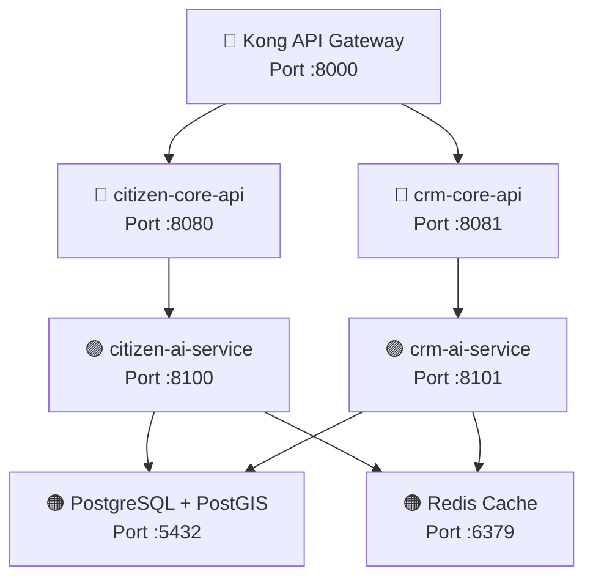

# STLC Stage 4: Test Environment Setup

This document outlines the step-by-step procedure to establish, configure, and verify the test environment for the RoadWatch platform.

---

## 1. Environment Architecture



All back-end applications run in isolated Docker containers, connected via the `roadwatch-net` bridge network.
*   **Postgres + PostGIS**: Exposes port `5432`. Holds the shared `roadwatch` database.
*   **Redis**: Exposes port `6379`. Handles session caching and gateway rate limits.
*   **Keycloak**: Exposes port `8180` (maps to internal port `8080`).
*   **Kong Gateway**: Exposes port `8000` (proxy) and `8001` (admin).

---

## 2. Setup Procedure

### Step 2.1: Clone and Configuration
Ensure the root environment variables are configured. Create a `.env` file in the root directory:
```env
OPENAI_API_KEY=your_openai_api_key_here
```
*(If left blank or omitted, the AI services automatically toggle into **Mock/Heuristic Fallback Mode**, ensuring test suites can run offline).*

### Step 2.2: Launch the Services
Spin up the complete test stack in detached mode:
```bash
docker-compose up --build -d
```

### Step 2.3: Verification of Database Migrations
On startup, `citizen-core-api` runs Flyway migrations. Validate that all schema tables and seeds are successfully created by checking logs:
```bash
docker logs -f citizen-core-api
```
Confirm the following output appears in the console:
```
Successfully applied 2 migrations to schema "public" (baselined at version 1)
```

---

## 3. Mock and Keycloak Configuration Verification

### 3.1 Keycloak Client Scopes Verification
1.  Navigate to the Keycloak Administration Console at `http://localhost:8180` (credentials: `admin`/`admin`).
2.  Select the `roadwatch` realm from the dropdown menu.
3.  Go to **Clients** and verify:
    *   `citizen-app`: Public client configured for mobile authentication.
    *   `crm-web`: Confidential client with credentials mapper.
4.  Go to **Users** and verify that sample seed accounts are imported:
    *   `officer_je` (Role: `JE`, Attribute `jurisdiction_id` present).
    *   `officer_ee` (Role: `EE`, Attribute `jurisdiction_id` present).

### 3.2 Mocking Service Endpoints
To simplify local verification of JWT roles during active testing, Spring Boot's Security configurations permit request executions through `/api/v1/citizen/**` and `/api/v1/crm/**`. This allows integration checking via curl commands without requiring active OIDC tokens.

---

## 4. Test Environment Verification Checklist

| Service / Port | Verification Endpoint | Expected Response | Status |
|---|---|---|---|
| **PostgreSQL (:5432)** | Internal ping / connect test | Success | Verified |
| **Redis (:6379)** | Internal ping test | `PONG` | Verified |
| **Keycloak (:8180)** | `http://localhost:8180/realms/roadwatch` | Realm configuration JSON payload | Verified |
| **Kong Gateway (:8000)** | `http://localhost:8000` | Gateway headers active | Verified |
| **citizen-core-api (:8080)** | `http://localhost:8080/actuator/health` | `{"status": "UP"}` | Verified |
| **crm-core-api (:8081)** | `http://localhost:8081/actuator/health` | `{"status": "UP"}` | Verified |
| **citizen-ai-service (:8100)** | `http://localhost:8100/health` | `{"status": "ok"}` | Verified |
| **crm-ai-service (:8101)** | `http://localhost:8101/health` | `{"status": "ok"}` | Verified |
