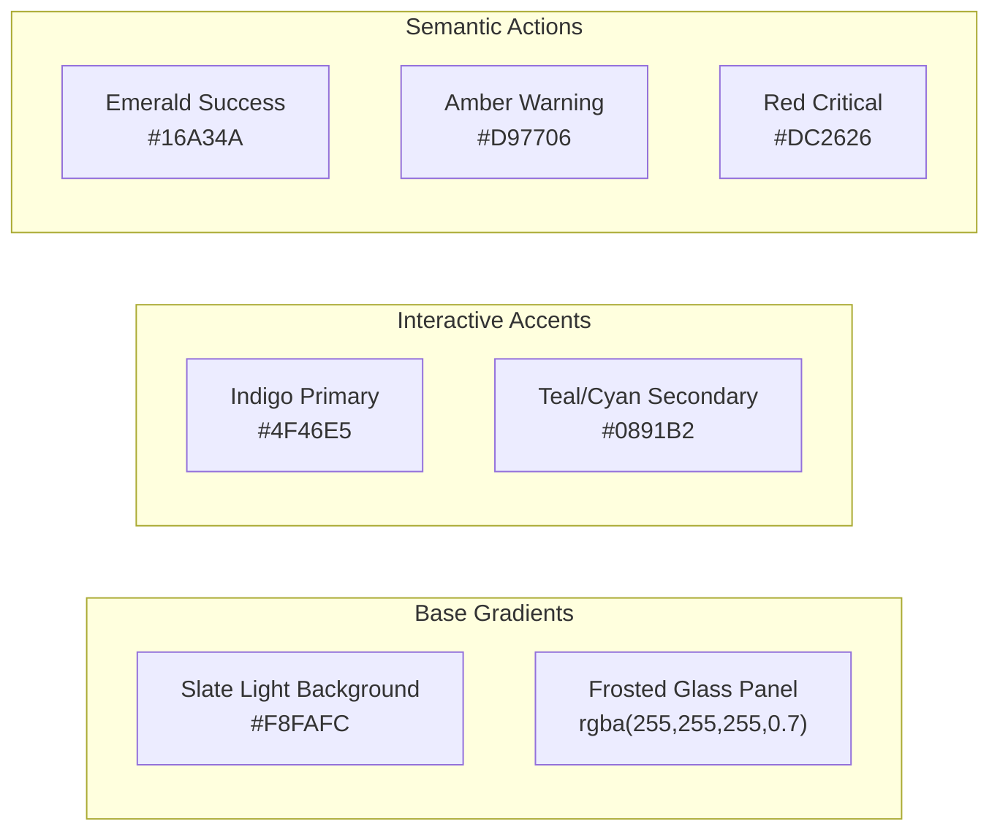

# RoadWatch Global UI/UX Design System Specification (Premium Light Theme)

This document defines the visual system, UI tokens, layout guidelines, and micro-interactions for the **RoadWatch** product suite (mobile **Citizen App** and desktop **Govt CRM Portal**), focused entirely on a **Sleek Premium Frosted Light Theme**.

Use this specification as the **System Prompt Context** or **Visual Token Source** for design agents (such as Google Stitch, Claude Design, or Aura AI Designer) to build precise, pixel-perfect, and cohesive interfaces.

---

## 1. Visual Philosophy & Design Direction

RoadWatch utilizes a **Sleek Premium Frosted Light System**. The aesthetic leans into a crisp, high-trust, and highly legible light-canvas layout using "frosted glass" panels, soft drop shadows, and high-contrast accessible functional accents.

### Key Principles
*   **High-Trust Transparency**: Soft, translucent white panels layered over a clean light-slate canvas mirror professional government portal designs.
*   **Accessible Contrasts (WCAG 2.1 AA)**: All text scales and functional badges meet strict contrast requirements ($>4.5:1$ ratio) against the light background by utilizing slightly deepened semantic accent colors.
*   **Soft Spatial Depth**: Containers are separated by elegant drop shadows and thin, light-grey perimeter borders rather than heavy colored dividers.
*   **Micro-Interaction Feedback**: Hover and active press states provide a physical feel using scaling transformations, soft glow offsets, and crisp border transitions.

---

## 2. Core Color Tokens (Hex & HSL Scales)



### 2.1 Backgrounds & Neutral Scale
| Token | Variable Name | Hex Code | HSL / RGBA Value | UI Role |
| :--- | :--- | :--- | :--- | :--- |
| **Slate Light** | `--bg-light` | `#F8FAFC` | `hsl(210, 40%, 98%)` | Primary canvas background. |
| **Slate Elevated** | `--bg-panel` | `#FFFFFF` | `hsl(0, 0%, 100%)` | Secondary solid sheets (no blur support). |
| **Frosted Glass**| `--bg-glass` | N/A | `rgba(255, 255, 255, 0.7)` | Standard card/panel background (with blur). |
| **Border Glass** | `--border-glass` | N/A | `rgba(15, 23, 42, 0.08)`| Outer border defining card structures. |
| **Text Primary** | `--text-primary` | `#0F172A` | `hsl(222, 47%, 11%)` | Primary titles, reading text, input text. |
| **Text Secondary** | `--text-secondary`| `#475569` | `hsl(215, 16%, 47%)` | Subtitles, labels, timestamps, helpers. |

### 2.2 Functional Accents
| Token | Variable Name | Hex Code | HSL Value | Design & Glow Behavior |
| :--- | :--- | :--- | :--- | :--- |
| **Indigo Prime** | `--accent-indigo`| `#4F46E5` | `hsl(243, 75%, 59%)` | Primary action buttons, selected tabs, headers. Glow: `0 0 12px rgba(79, 70, 229, 0.2)`. |
| **Ocean Teal** | `--accent-teal` | `#0891B2` | `hsl(191, 91%, 38%)` | Interactive filters, search focus flags, hyperlinks. Glow: `0 0 10px rgba(8, 145, 178, 0.15)`. |
| **Forest Emerald**| `--success` | `#16A34A` | `hsl(142, 72%, 29%)` | Resolved status badges, positive verification ticks. |
| **Amber Gold** | `--warning` | `#D97706` | `hsl(35, 92%, 43%)` | SLA Breach warning, offline sync pending, medium priority. |
| **Crimson Red** | `--danger` | `#DC2626` | `hsl(0, 72%, 46%)` | Critical priority, BLACKSPOT markers, SLA breaches, system errors. |

---

## 3. Frosted Glassmorphism Styling Specifications (CSS Rules)

For web and desktop layout generation, use these exact CSS properties to render frosted containers:

```css
/* Frosted Glass Card Base Styles */
.glass-card {
  background: rgba(255, 255, 255, 0.7);
  backdrop-filter: blur(12px) saturate(120%);
  -webkit-backdrop-filter: blur(12px) saturate(120%);
  border: 1px solid rgba(15, 23, 42, 0.08);
  border-radius: 16px;
  box-shadow: 0 10px 30px -10px rgba(15, 23, 42, 0.04),
              0 1px 3px 0 rgba(15, 23, 42, 0.02);
  transition: transform 0.25s cubic-bezier(0.4, 0, 0.2, 1), 
              border-color 0.25s cubic-bezier(0.4, 0, 0.2, 1), 
              box-shadow 0.25s cubic-bezier(0.4, 0, 0.2, 1);
}

/* Frosted Glass Card Hover State */
.glass-card:hover {
  transform: translateY(-2px);
  border-color: rgba(79, 70, 229, 0.25); /* Glowing Indigo border tint */
  box-shadow: 0 20px 40px -15px rgba(79, 70, 229, 0.08),
              0 4px 12px 0 rgba(15, 23, 42, 0.05);
}

/* Inner Horizontal Divider */
.glass-divider {
  height: 1px;
  background: linear-gradient(
    90deg,
    rgba(15, 23, 42, 0) 0%,
    rgba(15, 23, 42, 0.06) 50%,
    rgba(15, 23, 42, 0) 100%
  );
  margin: 16px 0;
}
```

---

## 4. Typography Scale & Layout Foundations

### 4.1 Fonts
*   **Desktop CRM Web**: Font-family: `'Outfit', -apple-system, sans-serif`. High geometry, editorial feel.
*   **Mobile Citizen App**: Font-family: `'Inter', -apple-system, sans-serif`. Maximum pixel density readability.

### 4.2 Hierarchy Chart (Standardized)
| Scale Token | Font Size | Line Height | Weight | Usage |
| :--- | :--- | :--- | :--- | :--- |
| **Display Header** | `2.25rem` (36px) | `2.75rem` | 700 (Bold) | Main metric numbers, budgets sums |
| **Section Title** | `1.5rem` (24px) | `2.0rem` | 600 (Semi-Bold)| Panels headers, drawer titles |
| **Grid / Card Title** | `1.125rem` (18px) | `1.5rem` | 600 (Semi-Bold)| Item list headers, timeline steps |
| **Body Primary** | `1.0rem` (16px) | `1.5rem` | 400 (Regular) | Message bubbles, detailed descriptions |
| **Body Secondary** | `0.875rem` (14px) | `1.25rem` | 400 (Regular) | SLA trackers, address labels, helper text |
| **Caption / Badge**| `0.75rem` (12px) | `1.0rem` | 700 (Bold) | Priority tags, categorization labels |

---

## 5. Mobile Layout Design Bounds (Citizen App)

For React Native generators, lay out the screens using these boundary guidelines:

```
+------------------------------------------+  <- 0px (Top)
|   Status Bar Safe Area (44px on iPhone)  |  <- Top Safe Area (Injected via useSafeAreaInsets)
+------------------------------------------+
|   Sticky Frosted Header (64px)           |  <- Frosted container with thin bottom border
+------------------------------------------+
|                                          |
|                                          |
|         Interactive Main Body            |  <- Map view or Form layout
|                                          |
|                                          |
+------------------------------------------+
|   Sticky Bottom Navigation Bar (80px)    |  <- Frosted white blur panel
+------------------------------------------+
|   Home Indicator Area (34px on iPhone)   |  <- Bottom Safe Area
+------------------------------------------+  <- Viewport Height Limit
```

### Safe Area Settings
*   **Side Padding Padding**: `16px` constant side margin.
*   **Minimum Target Touch Sizes**: `48px x 48px` absolute minimum.

---

## 6. Micro-Animations & Dynamic States Spec

### 6.1 State Transitions
```css
transition-timing-function: cubic-bezier(0.4, 0, 0.2, 1);
transition-duration: 200ms;
```

### 6.2 State Spec Table
| Element Type | Active State (Idle) | Hover / Active Press State | Focused Input State | Loading / Waiting State |
| :--- | :--- | :--- | :--- | :--- |
| **Buttons** | Solid Indigo base, text white, opacity 1. | Scale: `0.98` (Click) or `1.02` (Hover). Subtle shadow depth increases. | Glowing cyan border ring outline (`outline: 2px solid #0891B2`). | 50% opacity, pointer: `wait`, inner activity indicator active. |
| **Form Inputs** | Pure white background, `rgba(15,23,42,0.08)` border. | Border opacity increases to `0.15`. | Border changes to Ocean Teal, inner shadows trigger. | Disabled, background shifted to light grey `#F1F5F9`. |
| **List Cards** | Frosted Glass base, `rgba(15,23,42,0.08)` border. | Translate: `translateY(-2px)`, shadow increases, border turns Indigo. | N/A | Pulse animation: background opacity cycles from `0.4` to `0.8` every `1.5s`. |
| **AI Stream Bubbles**| Frosted Glass panel container. | N/A | N/A | Three bouncing grey dots inside a pulsing frosted bubble. |
